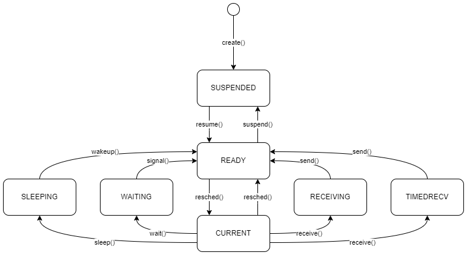

# CIS 657 Principles of Operating Systems
## cis-657-principles-of-operating-systems

This course designs and implements changes to the Xinu operating system, found [here](https://github.com/radioxeth/xinu-shared).

## Table of Contents
- [Home](/README.md#table-of-contents)
- [Week 1 Introduction and Review, Concurrency, and Shared Memory](/week1/README.md#week-1-introduction-and-review-concurrency-and-shared-memory)
- [Week 2 Lists and Queues](/week2/README.md#week-2-lists-and-queues)
- [Week 3 CPU Scheduling](/week3/README.md#week-3-cpu-scheduling)
- [Week 4 Process Coordination](/week4/README.md#week-4-process-coordination)
- [Week 5 Memory Management](/week5/README.md#week-5-memory-management)
- [Week 6 Message Passing](/week6/README.md#week-6-message-passing)
- **[Week 7 Interrupts and Devices](/week7/README.md#week-7-interrupts-and-devices)**
- [Week 8 Devices](/week8/README.md#week-8-devices)
- [Week 9 Files](/week9/README.md#week-9-devices)
- [Week 10 Develop an Operating system](/week10/README.md#week-10-develop-an-operating-system)

### Xinu Process State Diagram

