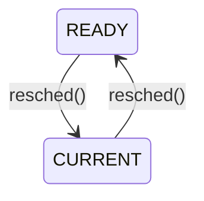
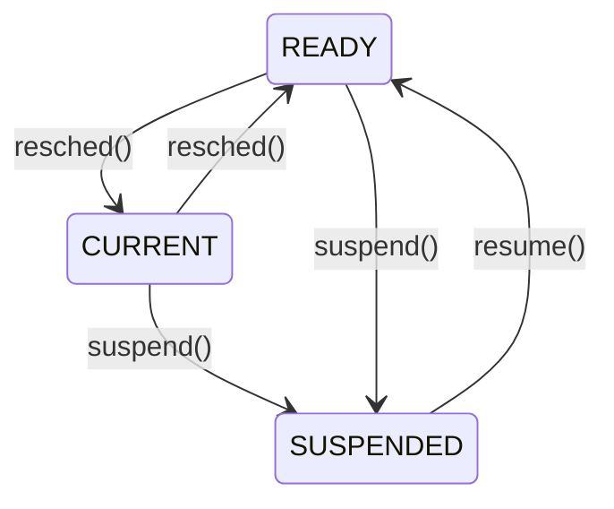

# Week 4 Process Coordination

## Directory 

- [Home](/README.md#table-of-contents)
- [Week 3 CPU Scheduling](/week3/README.md#week-3-cpu-scheduling)
- **[Week 4 Process Coordination](/week4/README.md#week-4-process-coordination)**
- [Week 5 Memory Management](/week5/README.md#week-5-memory-management)

## 4.1 System Calls in Xinu
([top](#directory))

### System Calls
- system calls in Xinu have two purposes:
  - implementation hiding (abstraction)
  - Protectoin from illegal/improper arguments

- Contrast the `resume()` system call with `ready()` internal function
  - both make a process `READY` and put it in the ready list
  - `resume()` error checks; `ready()` does not
  - power tools can injure...

### System Call Template

```c
syscall function_name (args){   //syscall return type
    initmask mask;              // saved interrupt mask

    mask = disable();           // disable interrupts at start of function

    if(args are incorrect){
        restore(mask);          // restore interrupts before error return
        return SYSERR;
    }

    ... other processing ...

    if(an error occurs){
        restore(mask);          // restore interrupts before error return
    }

    ... more processing ....
    restore(mask);              // restore interrupts before normal return
    return appropriate value;   // OK, pid, etc
}
```

### Disableing Restoring Interrupts

- on a uniprocessor, disabling iterrupts prevents any context switchtes
- devices also ignored, so keep it short!
- system calls in xinu use `disable()`/`restore()` to provide mutual exclusion on system data structures
  - only works for uniprocessors
  - discuss more general solutions later

```c
intmask mask;
...
mask=disable();
...
restore(mask)
```

- `disable()` turns off all interrupts
  - no device will receive attention
  - returns status of interrupts before this `disable()` call
- `restore()` does not simply enable interrupts
  - if it did, it wouldn't need an argument
  - instead, it makes them what they were before the call to `disable()`
  - hence the *mask* argument
- nested functions can call `disable()`/`restore()`

## 4.3 Additional Process Management
([top](#directory))

### Process State We've Seen


### Suspend/Resume
- `suspend()` temporarily blocks a process in suspended animation
- stopped in time; cannot run
- therefore cannot be `CURRENT` or `READY`
- new state `SUSPENDED`
- to make ready again: `resume()`
- we saw this already: `create()` puts the new process in `SUSPENDED` state


### New Process State Graph



### `suspend()`/`resume()` Take and Argument
- recall that `resched()` implicitly worked on the current process and first in the ready queue
- `suspend()` and `resume()` can work on any process in `CURRENT` or `READY` stae
- the current process can suspend itself
- it's impossible for a process to resume itself.

### Self-Suspension
- How? Suspend(currpid) would work.
- But depends on knowledge of how the current process id is stored in the system
- Better: use `getpid()` system call
  - `suspend(getpid())`
- allows us to change the implementation of the OS without changing code that uses result of `getpid()`
- Abstraction in Action!


### Code for Suspend()

```c
/* suspend.c - suspend */

#include <xinu.h>

/*------------------------------------------------------------------------
 *  suspend  -  Suspend a process, placing it in hibernation
 *------------------------------------------------------------------------
 */
syscall	suspend(
	  pid32		pid		/* ID of process to suspend	*/
	)
{
	intmask	mask;			/* saved interrupt mask		*/
	struct	procent *prptr;		/* ptr to process' table entry	*/
	pri16	prio;			/* priority to return		*/

	mask = disable();
	if (isbadpid(pid) || (pid == NULLPROC)) {
		restore(mask);
		return SYSERR;
	}

	/* Only suspend a process that is current or ready */

	prptr = &proctab[pid];
	if ((prptr->prstate != PR_CURR) && (prptr->prstate != PR_READY)) {
		restore(mask);
		return SYSERR;
	}
	if (prptr->prstate == PR_READY) {
		getitem(pid);		    /* remove a ready process	*/
					    /* from the ready list	*/
		prptr->prstate = PR_SUSP;
	} else {
		prptr->prstate = PR_SUSP;   /* mark the current process	*/
		resched();		    /* suspended and reschedule	*/
	}
	prio = prptr->prprio;
	restore(mask);
	return prio;
}
```

### What `suspend()` returns
- `suspend()` returns the priority of the suspended process
- for a `READY` process, obviously the priority at the time of the `suspended()` call
- what about the `CURRENT` process?
  - could record prio at time of call (just before `resched()`)

### Motivation for Saving afer Resumption
- priority can change while process is suspended
- allows information to be conveyed about what happened
- suppose can be awakened by two events
- assign unique priority to each event

```c
newprio = suspend(getpid());
if (newprio==25) {
    /* ...event 1 occured... */
} else {
    /* ...event 2 occured... */
}
```

### Code fore `resume()`

```c
/* resume.c - resume */

#include <xinu.h>

/*------------------------------------------------------------------------
 *  resume  -  Unsuspend a process, making it ready
 *------------------------------------------------------------------------
 */
pri16	resume(  // still a system call
	  pid32		pid		/* ID of process to unsuspend	*/
	)
{
	intmask	mask;			/* saved interrupt mask		*/
	struct	procent *prptr;		/* ptr to process' table entry	*/
	pri16	prio;			/* priority to return		*/

	mask = disable();
	if (isbadpid(pid)) {
		restore(mask);
		return (pri16)SYSERR;
	}
	prptr = &proctab[pid];
	if (prptr->prstate != PR_SUSP) {
		restore(mask);
		return (pri16)SYSERR;
	}
	prio = prptr->prprio;		/* record priority to return	*/
	ready(pid, RESCHED_YES);
	restore(mask);
	return prio;
}
```

### Not on Reading Xinu Code
- practice reading the Xinu code as we have done
- get used to patterns
- from here on out, we'll cover only the highlights/special features of code
