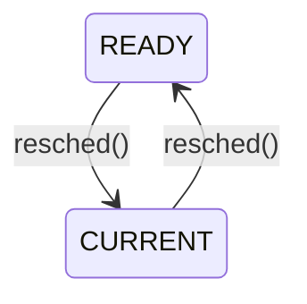

# Week 4 Process Coordination

## Directory 

- [Home](/README.md#table-of-contents)
- [Week 3 CPU Scheduling](/week3/README.md#week-3-cpu-scheduling)
- **[Week 4 Process Coordination](/week4/README.md#week-4-process-coordination)**
- [Week 5 Memory Management](/week5/README.md#week-5-memory-management)

## 4.1 System Calls in Xinu
([top](#directory))

### System Calls
- system calls in Xinu have two purposes:
  - implementation hiding (abstraction)
  - Protectoin from illegal/improper arguments

- Contrast the `resume()` system call with `ready()` internal function
  - both make a process `READY` and put it in the ready list
  - `resume()` error checks; `ready()` does not
  - power tools can injure...

### System Call Template

```c
syscall function_name (args){   //syscall return type
    initmask mask;              // saved interrupt mask

    mask = disable();           // disable interrupts at start of function

    if(args are incorrect){
        restore(mask);          // restore interrupts before error return
        return SYSERR;
    }

    ... other processing ...

    if(an error occurs){
        restore(mask);          // restore interrupts before error return
    }

    ... more processing ....
    restore(mask);              // restore interrupts before normal return
    return appropriate value;   // OK, pid, etc
}
```

### Disableing Restoring Interrupts

- on a uniprocessor, disabling iterrupts prevents any context switchtes
- devices also ignored, so keep it short!
- system calls in xinu use `disable()`/`restore()` to provide mutual exclusion on system data structures
  - only works for uniprocessors
  - discuss more general solutions later

```c
intmask mask;
...
mask=disable();
...
restore(mask)
```

- `disable()` turns off all interrupts
  - no device will receive attention
  - returns status of interrupts before this `disable()` call
- `restore()` does not simply enable interrupts
  - if it did, it wouldn't need an argument
  - instead, it makes them what they were before the call to `disable()`
  - hence the *mask* argument
- nested functions can call `disable()`/`restore()`

## 4.3 Additional Process Management
([top](#directory))

### Process State We've Seen
