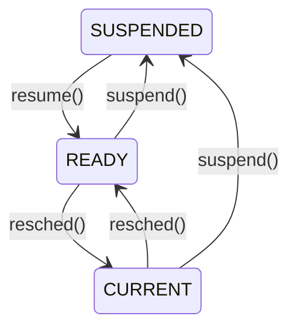
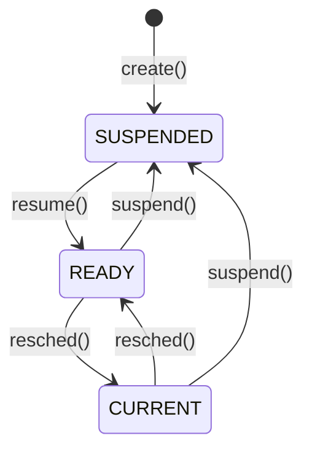
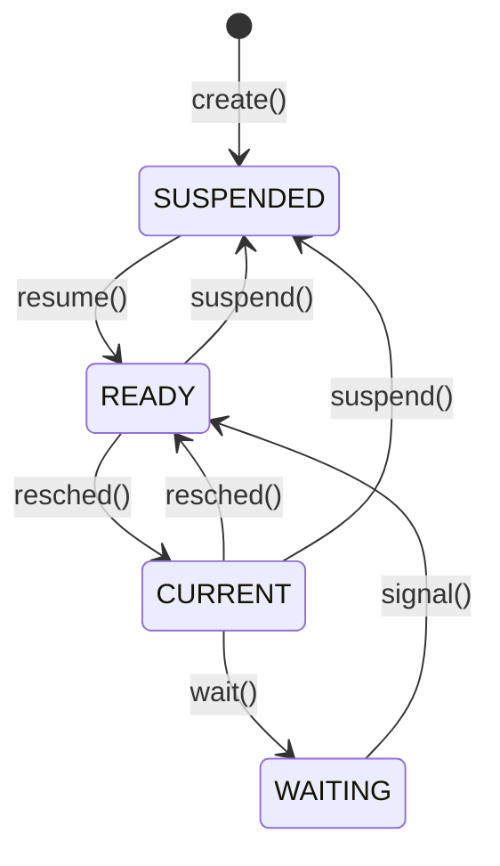

# Week 4 Process Coordination

## Directory 

- [Home](/README.md#table-of-contents)
- [Week 3 CPU Scheduling](/week3/README.md#week-3-cpu-scheduling)
- **&rarr;[Week 4 Process Coordination](/week4/README.md#week-4-process-coordination)**
- [Week 5 Memory Management](/week5/README.md#week-5-memory-management)

## 4.1 System Calls in Xinu
([top](#directory))

### System Calls
- system calls in Xinu have two purposes:
  - implementation hiding (abstraction)
  - Protectoin from illegal/improper arguments

- Contrast the `resume()` system call with `ready()` internal function
  - both make a process `READY` and put it in the ready list
  - `resume()` error checks; `ready()` does not
  - power tools can injure...

### System Call Template

```c
syscall function_name (args){   //syscall return type
    initmask mask;              // saved interrupt mask

    mask = disable();           // disable interrupts at start of function

    if(args are incorrect){
        restore(mask);          // restore interrupts before error return
        return SYSERR;
    }

    ... other processing ...

    if(an error occurs){
        restore(mask);          // restore interrupts before error return
    }

    ... more processing ....
    restore(mask);              // restore interrupts before normal return
    return appropriate value;   // OK, pid, etc
}
```

### Disableing Restoring Interrupts

- on a uniprocessor, disabling iterrupts prevents any context switchtes
- devices also ignored, so keep it short!
- system calls in xinu use `disable()`/`restore()` to provide mutual exclusion on system data structures
  - only works for uniprocessors
  - discuss more general solutions later

```c
intmask mask;
...
mask=disable();
...
restore(mask)
```

- `disable()` turns off all interrupts
  - no device will receive attention
  - returns status of interrupts before this `disable()` call
- `restore()` does not simply enable interrupts
  - if it did, it wouldn't need an argument
  - instead, it makes them what they were before the call to `disable()`
  - hence the *mask* argument
- nested functions can call `disable()`/`restore()`

## 4.3 Additional Process Management
([top](#directory))

### Process State We've Seen


### Suspend/Resume
- `suspend()` temporarily blocks a process in suspended animation
- stopped in time; cannot run
- therefore cannot be `CURRENT` or `READY`
- new state `SUSPENDED`
- to make ready again: `resume()`
- we saw this already: `create()` puts the new process in `SUSPENDED` state


### New Process State Graph



### `suspend()`/`resume()` Take and Argument
- recall that `resched()` implicitly worked on the current process and first in the ready queue
- `suspend()` and `resume()` can work on any process in `CURRENT` or `READY` stae
- the current process can suspend itself
- it's impossible for a process to resume itself.

### Self-Suspension
- How? Suspend(currpid) would work.
- But depends on knowledge of how the current process id is stored in the system
- Better: use `getpid()` system call
  - `suspend(getpid())`
- allows us to change the implementation of the OS without changing code that uses result of `getpid()`
- Abstraction in Action!


### Code for Suspend()

```c
/* suspend.c - suspend */

#include <xinu.h>

/*------------------------------------------------------------------------
 *  suspend  -  Suspend a process, placing it in hibernation
 *------------------------------------------------------------------------
 */
syscall	suspend(
	  pid32		pid		/* ID of process to suspend	*/
	)
{
	intmask	mask;			/* saved interrupt mask		*/
	struct	procent *prptr;		/* ptr to process' table entry	*/
	pri16	prio;			/* priority to return		*/

	mask = disable();
	if (isbadpid(pid) || (pid == NULLPROC)) {
		restore(mask);
		return SYSERR;
	}

	/* Only suspend a process that is current or ready */

	prptr = &proctab[pid];
	if ((prptr->prstate != PR_CURR) && (prptr->prstate != PR_READY)) {
		restore(mask);
		return SYSERR;
	}
	if (prptr->prstate == PR_READY) {
		getitem(pid);		    /* remove a ready process	*/
					    /* from the ready list	*/
		prptr->prstate = PR_SUSP;
	} else {
		prptr->prstate = PR_SUSP;   /* mark the current process	*/
		resched();		    /* suspended and reschedule	*/
	}
	prio = prptr->prprio;
	restore(mask);
	return prio;
}
```

### What `suspend()` returns
- `suspend()` returns the priority of the suspended process
- for a `READY` process, obviously the priority at the time of the `suspended()` call
- what about the `CURRENT` process?
  - could record prio at time of call (just before `resched()`)

### Motivation for Saving afer Resumption
- priority can change while process is suspended
- allows information to be conveyed about what happened
- suppose can be awakened by two events
- assign unique priority to each event

```c
newprio = suspend(getpid());
if (newprio==25) {
    /* ...event 1 occured... */
} else {
    /* ...event 2 occured... */
}
```

### Code fore `resume()`

```c
/* resume.c - resume */

#include <xinu.h>

/*------------------------------------------------------------------------
 *  resume  -  Unsuspend a process, making it ready
 *------------------------------------------------------------------------
 */
pri16	resume(  // still a system call
	  pid32		pid		/* ID of process to unsuspend	*/
	)
{
	intmask	mask;			/* saved interrupt mask		*/
	struct	procent *prptr;		/* ptr to process' table entry	*/
	pri16	prio;			/* priority to return		*/

	mask = disable();
	if (isbadpid(pid)) {
		restore(mask);
		return (pri16)SYSERR;
	}
	prptr = &proctab[pid];
	if (prptr->prstate != PR_SUSP) {
		restore(mask);
		return (pri16)SYSERR;
	}
	prio = prptr->prprio;		/* record priority to return	*/
	ready(pid, RESCHED_YES);
	restore(mask);
	return prio;
}
```

### Note on Reading Xinu Code
- practice reading the Xinu code as we have done
- get used to patterns
- from here on out, we'll cover only the highlights/special features of code


## 4.4 Process Creation and Termination
([top](#directory))

### BEfore Next Sunchronouse Session

study `create()` system call
- look at how the stack frame for the call to the function (procaddr) is constructed
```c

/* create.c - create, newpid */
    
#include <xinu.h>

local	int newpid();

#define	roundew(x)	( (x+3)& ~0x3)

/*------------------------------------------------------------------------
 *  create  -  create a process to start running a procedure
 *------------------------------------------------------------------------
 */
pid32	create(
	  void		*procaddr,	/* procedure address		*/
	  uint32	ssize,		/* stack size in words		*/
	  pri16		priority,	/* process priority > 0		*/
	  char		*name,		/* name (for debugging)		*/
	  uint32	nargs,		/* number of args that follow	*/
	  ...
	)
{
	uint32		savsp, *pushsp;
	intmask 	mask;    	/* interrupt mask		*/
	pid32		pid;		/* stores new process id	*/
	struct	procent	*prptr;		/* pointer to proc. table entry */
	int32		i;
	uint32		*a;		/* points to list of args	*/
	uint32		*saddr;		/* stack address		*/

	mask = disable();
	if (ssize < MINSTK)
		ssize = MINSTK;
	ssize = (uint32) roundew(ssize);
	if (((saddr = (uint32 *)getstk(ssize)) ==
	    (uint32 *)SYSERR ) ||
	    (pid=newpid()) == SYSERR || priority < 1 ) {
		restore(mask);
		return SYSERR;
	}

	prcount++;
	prptr = &proctab[pid];

	/* initialize process table entry for new process */
	prptr->prstate = PR_SUSP;	/* initial state is suspended	*/
	prptr->prprio = priority;
	prptr->prstkbase = (char *)saddr;
	prptr->prstklen = ssize;
	prptr->prname[PNMLEN-1] = NULLCH;
	for (i=0 ; i<PNMLEN-1 && (prptr->prname[i]=name[i])!=NULLCH; i++)
		;
	prptr->prsem = -1;
	prptr->prparent = (pid32)getpid();
	prptr->prhasmsg = FALSE;

	/* set up initial device descriptors for the shell		*/
	prptr->prdesc[0] = CONSOLE;	/* stdin  is CONSOLE device	*/
	prptr->prdesc[1] = CONSOLE;	/* stdout is CONSOLE device	*/
	prptr->prdesc[2] = CONSOLE;	/* stderr is CONSOLE device	*/

	/* Initialize stack as if the process was called		*/

	*saddr = STACKMAGIC;
	savsp = (uint32)saddr;

	/* push arguments */
	a = (uint32 *)(&nargs + 1);	/* start of args		*/
	a += nargs -1;			/* last argument		*/
	for ( ; nargs > 0 ; nargs--)	/* machine dependent; copy args	*/
		*--saddr = *a--;	/* onto created process' stack	*/
	*--saddr = (long)INITRET;	/* push on return address	*/

	/* The following entries on the stack must match what ctxsw	*/
	/*   expects a saved process state to contain: ret address,	*/
	/*   ebp, interrupt mask, flags, registerss, and an old SP	*/

	*--saddr = (long)procaddr;	/* Make the stack look like it's*/
					/*  half-way through a call to	*/
					/*  ctxsw that "returns" to the	*/
					/*  new process			*/
	*--saddr = savsp;		/* This will be register ebp	*/
					/*  for process exit		*/
	savsp = (uint32) saddr;		/* start of frame for ctxsw	*/
	*--saddr = 0x00000200;		/* New process runs with	*/
					/*  interrupts enabled		*/

	/* Basically, the following emulates a x86 "pushal" instruction	*/

	*--saddr = 0;		/* %eax */
	*--saddr = 0;		/* %ecx */
	*--saddr = 0;		/* %edx */
	*--saddr = 0;		/* %ebx */
	*--saddr = 0;		/* %esp; value filled in below */
	pushsp = saddr;		/*  remember this location */
	*--saddr = savsp;	/* %ebp (while finishing ctxsw) */
	*--saddr = 0;		/* %esi */
	*--saddr = 0;		/* %edi */
	*pushsp = (unsigned long) (prptr->prstkptr = (char *)saddr);
	restore(mask);
	return pid;
}

/*------------------------------------------------------------------------
 *  newpid  -  Obtain a new (free) process ID
 *------------------------------------------------------------------------
 */
local	pid32	newpid(void)
{
	uint32	i;			/* iterate through all processes*/
	static	pid32 nextpid = 1;	/* position in table to try or	*/
					/*  one beyond end of table	*/

	/* check all NPROC slots */

	for (i = 0; i < NPROC; i++) {
		nextpid %= NPROC;	/* wrap around to beginning */
		if (proctab[nextpid].prstate == PR_FREE) {
			return nextpid++;
		} else {
			nextpid++;
		}
	}
	return (pid32) SYSERR;
}
```

### Steps in `create()`

1. Allocate and initialize process table entry
   1. state(`PR_SUSP`)
   2. Priority (argument)
   3. Stack address and size (arguments)
   4. Name (argument)
   5. Semaphore ID (-1)
   6. Parent PID
   7. Message flag
   8. stdin, stdout, stderr descriptors
2. Build stack frame for call to `procaddr` argument
   - arguments
   - Return address (`userret()`)
   - Suitable for `ctxsw()` to restore state
> If a process returns from the initial (top-level) function in which its execution starts, the process exits. - *Operating System Design*, Comer p111

### Updated Process State Graph



### Process Termination and Exit

- Three ways a process can end:
  1. Completion of function (final return)
  2. Error forcing OS code to terminate it
  3. Being terminated by a process
- All of them actually use the `kill()` routine
  1. `userret()` calls `kill(getpid())`
  2. error handler calls `kill(getpid())`
  3. any process might call `kill(pid)`

### Completion of Function
- recall that a stack frame was build at process creation with the return address `userret`

```c
/* userret.c - userret */

#include <xinu.h>

/*------------------------------------------------------------------------
 *  userret  -  Called when a process returns from the top-level function
 *------------------------------------------------------------------------
 */
void	userret(void)
{
	kill(getpid());			/* force process exit */
}
```

### code for `kill()`

```c
/* kill.c - kill */

#include <xinu.h>

/*------------------------------------------------------------------------
 *  kill  -  Kill a process and remove it from the system
 *------------------------------------------------------------------------
 */
syscall	kill(
	  pid32		pid		/* ID of process to kill	*/
	)
{
	intmask	mask;			/* saved interrupt mask		*/
	struct	procent *prptr;		/* ptr to process' table entry	*/
	int32	i;			/* index into descriptors	*/

	mask = disable();
	if (isbadpid(pid) || (pid == NULLPROC)
	    || ((prptr = &proctab[pid])->prstate) == PR_FREE) { // don't kill a bad process, free or null
		restore(mask);
		return SYSERR;
	}

	if (--prcount <= 1) {		/* last user process completes, remember the null process	*/
		xdone();
	}

	send(prptr->prparent, pid);
	for (i=0; i<3; i++) {
		close(prptr->prdesc[i]);
	}
	freestk(prptr->prstkbase, prptr->prstklen);

	switch (prptr->prstate) {
	case PR_CURR:
		prptr->prstate = PR_FREE;	/* suicide */
		resched();

	case PR_SLEEP:
	case PR_RECTIM:
		unsleep(pid);
		prptr->prstate = PR_FREE;
		break;

	case PR_WAIT:
		semtab[prptr->prsem].scount++;
		/* fall through */

	case PR_READY:
		getitem(pid);		/* remove from queue */
		/* fall through */

	default:
		prptr->prstate = PR_FREE;
	}

	restore(mask);
	return OK;
}
```

### Stopping the System
- when the last user process is killed, shut down the system
- options:
  - reboot
  - halt the processor

```c
/* xdone.c - xdone */

#include <xinu.h>

/*------------------------------------------------------------------------
 *  xdone  -  Print system completion message as last thread exits
 *------------------------------------------------------------------------
 */
void	xdone(void)
{
	kprintf("\r\n\r\nAll user processes have completed.\r\n\r\n");
	halt();				/* halt the processor		*/
}
```

### Aditional Process Management Calls

- `getprio(pid)`
  - return priority of argument
- `getpid()` return current process's pid
- `chprio(pid, newprio)`
  - set pid's priorty to `newprio`

## 4.5 Process Coordination in Detail
([top](#directory))

### Race Conditions Revisited
- race condition: output or state of system depends on timing/ordering of unpredicatble events
- when two competing processes attemp access to shared resource, whichever gets it wins the race
- most commonly, resource is shared memory location

### Example
- two equal-priority process(A and B)
- A shared variable (count)
- no coordination mechanism
- remember: we cannot assume rate of progress or relative speed
- role of interrupts (eg higher-priority web server, S)
- Both processes run this code

```c
for i := 1 to 3 {
	count := count + 2;
}
```
```asm
load  r1, count
add   r1, $2
store r1, count
```

### What happens when a packet arrives?
- recall
  - A and B equal priority
  - S the qeb server has higher priority
- `WLOG`, assum A running, B `READY`, S `RECV`
- network interface interrupts
- device driver handles packet
  - makes S `READY` calls `resched()`
  - A put behind B in ready queue
  - S runs, the goes into `RECV` state (calls `resched()`)
  - B runs

### Unrolled loop bodies for each process (same for a and b)

Count is a shared variable
Do we care that r1 is used in both?
```asm
load  r1, count
add   r1, $2
store r1, count
load  r1, count
add   r1, $2
store r1, count
load  r1, count
add   r1, $2
store r1, count
```

A
||||r1|count|
|-|-|-|-|-|
||||0|0|
|load | r1,| count|0||
|add  | r1,| \$2|2||
|store| r1,| count||2|
|load | r1,| count|2||
|add  | r1,| \$2|4||
|store| r1,| count||4|
|||||&larr;|
|load | r1,| count|||
|add  | r1,| \$2|||
|store| r1,| count|||

&larr; new packet interrupt, switch to B

B
||||r1|count|
|-|-|-|-|-|
||||0|4|
|load | r1,| count|4||
|add  | r1,| \$2|6||
|store| r1,| count||6|
|load | r1,| count|6||
|add  | r1,| \$2|8||
|store| r1,| count||8|
|load | r1,| count|8||
|||||&larr;|
|add  | r1,| \$2|||
|store| r1,| count|||

&larr; new packet interrupt, switch to A

A
||||r1|count|
|-|-|-|-|-|
||||0|0|
|load | r1,| count|0||
|add  | r1,| \$2|2||
|store| r1,| count||2|
|load | r1,| count|2||
|add  | r1,| \$2|4||
|store| r1,| count||4|
|load | r1,| count|8|8|
|add  | r1,| \$2|10|8|
|store| r1,| count|10|10|
|||||&larr;|

&larr; back to B

B
||||r1|count|
|-|-|-|-|-|
||||0|4|
|load | r1,| count|4||
|add  | r1,| \$2|6||
|store| r1,| count||6|
|load | r1,| count|6||
|add  | r1,| \$2|8||
|store| r1,| count||8|
|load | r1,| count|8||
|add  | r1,| \$2|10||
|store| r1,| count||10|

- We were expecting 12 but got 10 for the final count value

### Problem

- we want a single C statement to be atomic

`count := count + 2;`

- but this is implemented with three instructions
```asm
load  r1, count
add   r1, $2
store r1, count
```

- we had a context switch between first and second instruction in process B

### How do we solve this?

- find a way to make code segments atomic
- aka the critical section problem

```c
while (true){
	entry //decide who gets in
	...critical section code...
	exit  // let another in
	...remainder code...
}
```

## 4.6 The Critical Section Problem
([top](#directory))

### Requirements for Solution to the Critical Section Problem
- mutual exclusion
  - only one process at a time in the critical esction
- progress
  - only processes in the entry section determine which gets into the CS
  - decision can't be put off indefinitely
- Bounded waiting
  - there is a finite limit on the number of times a process can request the CS before it gets in

### how can we provide mutex?

- we've already seen one example
```c
mask=disable();
...code...
restore(mask);
```

Problems
- no ther process can run
- bad solution for multiprocessor

### Better Solution for Multiprocessors
- spin locks
- busy waiting is BAD!
  - except when it's not
- this is when it's not bad
- in multiprocessor, we rely on hardware support as a fundamental building block for locks.

### Hardware: Memory-Interlocked Test-and-Set
- **memory-interlock**: allow only one process to use this instruction memory at a time
- two component operations, done *atomically*
  - read value of memory location, then...
  - write vvalue to the same location

### Spin lock using test-and-set

```c
SpinLock(*lock){
	while(test_and_set(lock));
}
```
- all processes using the metxt must acquire the lock
- this is a race condition, used intentionally
```c
SpinUnlock(*lock){
	*lock=0;
}
```

### Swap vs test-and-set

```c
test_and_set(*lock){
	int one=1;
	return swap(one, *lock);
}
```

### Use of Spin Locks
- busy waiting is BAD
- only for low-contention resources
  - do not gaurantee bounded wait
- lock typiclaly held for short tie
- result should be that very little time is wasted in the lock over the system
- Do spin locks allow deadlock or starvation?

### Recap on Mutex
- for uniprocessors,we can disable interrupts
- for multiprocesseors, we build spin locks out of test-and-set (or swap) instruction
- we still need more for CS solution
  - both can provide mutex only for short time
  - neither ensures bounded wait


### We've already seen a solution
- Semaphores!
- Build on top of primitive mutex to have complete solution to CS problem
- use a queue
  - progress: trivial! (choose head of queue)
  - bounded wait: we know no one will go twice before we do


## 4.7 Semaphores Part 1
([top](#directory))

### Beyond Critical sections: producer-consumer
- semaphores can solve the critical section problem
- Also can solve omre expressive coordination problems
- producer consumer example
  - producer fills buffer slots
  - consumer empties buffer slots
  - semaphore(s) coordinate them

### Xinu Semaphores
- queue-based
- counting semaphores
  - if count is negative: number of blocked processes
  - otherwise, numbre of available resource
  - `smecreate(count)`
  - mutex: `semcreate(1)`
- `wait()`: decrement count, block if <0
- `signal()`: increment count, ready if >=0


### Updated Process State Graph



### Semaphore Table (semaphore.h)

```c
/* semaphore.h - isbadsem */

#ifndef	NSEM
#define	NSEM		45	/* number of semaphores, if not defined	*/
#endif

/* Semaphore state definitions */

#define	S_FREE	0		/* semaphore table entry is available	*/
#define	S_USED	1		/* semaphore table entry is in use	*/

/* Semaphore table entry */
struct	sentry	{
	byte	sstate;		/* whether entry is S_FREE or S_USED	*/
	int32	scount;		/* count for the semaphore		*/
	qid16	squeue;		/* queue of processes that are waiting	*/
				/*     on the semaphore			*/
};

extern	struct	sentry semtab[];

#define	isbadsem(s)	((int32)(s) < 0 || (s) >= NSEM)
```

### Semaphore Queues
- the squeue field is allocated at system initialization
  - initialize.c
  - `sysinit()`

```c
/* Initialize semaphores */

for (i = 0; i < NSEM; i++) {
	semptr = &semtab[i];
	semptr->sstate = S_FREE;
	semptr->scount = 0;
	semptr->squeue = newqueue();
}
```
- two tables:
  - semaphore table
  - queue table

### code for `semcreate()`
```c
local	sid32	newsem(void);

/*------------------------------------------------------------------------
 *  semcreate  -  create a new semaphore and return the ID to the caller
 *------------------------------------------------------------------------
 */
sid32	semcreate(
	  int32		count		/* initial semaphore count	*/
	)
{
	intmask	mask;			/* saved interrupt mask		*/
	sid32	sem;			/* semaphore ID to return	*/

	mask = disable();

	if (count < 0 || ((sem=newsem())==SYSERR)) {
		restore(mask);
		return SYSERR;
	}
	semtab[sem].scount = count;	/* initialize table entry	*/

	restore(mask);
	return sem;
}
```
### code for newsem()
```c
/*------------------------------------------------------------------------
 *  newsem  -  allocate an unused semaphore and return its index
 *------------------------------------------------------------------------
 */
local	sid32	newsem(void)
{
	static	sid32	nextsem = 0;	/* next semaphore index to try	*/
	sid32	sem;			/* semaphore ID to return	*/
	int32	i;			/* iterate through # entries	*/

	for (i=0 ; i<NSEM ; i++) {
		sem = nextsem++;
		if (nextsem >= NSEM)
			nextsem = 0;
		if (semtab[sem].sstate == S_FREE) {
			semtab[sem].sstate = S_USED;
			return sem;
		}
	}
	return SYSERR;
	// only check table one time, if no free semaphores, return syserr
}
```

## 4.8 Semaphores Part 2
([top](#directory))

### code for `wait()`

```c
/* wait.c - wait */

#include <xinu.h>

/*------------------------------------------------------------------------
 *  wait  -  Cause current process to wait on a semaphore
 *------------------------------------------------------------------------
 */
syscall	wait(
	  sid32		sem		/* semaphore on which to wait  */
	)
{
	intmask mask;			/* saved interrupt mask		*/
	struct	procent *prptr;		/* ptr to process' table entry	*/
	struct	sentry *semptr;		/* ptr to sempahore table entry	*/

	mask = disable();
	if (isbadsem(sem)) {
		restore(mask);
		return SYSERR;
	}

	semptr = &semtab[sem];
	if (semptr->sstate == S_FREE) {
		restore(mask);
		return SYSERR;
	}

	//predecrement
	if (--(semptr->scount) < 0) {		/* if caller must block	*/
		prptr = &proctab[currpid];
		prptr->prstate = PR_WAIT;	/* set state to waiting	*/
		prptr->prsem = sem;		/* record semaphore ID	*/
		enqueue(currpid,semptr->squeue);/* enqueue on semaphore	*/
		resched();			/*   and reschedule	*/
	}

	restore(mask);
	return OK;
}
```

- why is it okay to reschedule with interrupts disabled?

### `Signal()`

```c
/*------------------------------------------------------------------------
 *  signal  -  Signal a semaphore, releasing a process if one is waiting
 *------------------------------------------------------------------------
 */
syscall	signal(
	  sid32		sem		/* id of semaphore to signal	*/
	)
{
	intmask mask;			/* saved interrupt mask		*/
	struct	sentry *semptr;		/* ptr to sempahore table entry	*/

	mask = disable();
	if (isbadsem(sem)) {
		restore(mask);
		return SYSERR;
	}
	semptr= &semtab[sem];
	if (semptr->sstate == S_FREE) {
		restore(mask);
		return SYSERR;
	}
	if ((semptr->scount++) < 0) {	/* release a waiting process */
		ready(dequeue(semptr->squeue), RESCHED_YES);
	}
	restore(mask);
	return OK;
}
```

### note on C semantics

`(semptr->scount++) < 0`

- ++ is the post-increment operator in C
- (x++) returns the value of x before is was incremented
- equivalent to

```c
int postinc(int *i){
	int j = *i;
	(*i) = (*i) + 1;
	return j;
}
```


### Additional Xinu semaphore functoins
- `semdelete(sem)`
  - free semaphore entry
  - make any waiting processes READY
- `semreset(sem, count)`
  - reinitialze a semaphore to a given count
  - make any waiting process READY
- `semcount(sem)`
  - return the current count of a semaphore
- `signaln(sem, n)`
  - equivalent to n calls to signal, done atomically