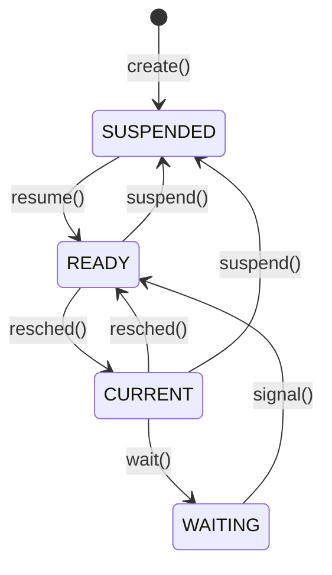

# Week 5 Memory Management

## Directory

- [Week 4 Process Coordination](/week4/README.md#week-4-process-coordination)
- **&rarr;[Week 5 Memory Management](/week5/README.md#week-5-memory-management)**
- [Week 6 Message Passing](/week6/README.md#week-6-message-passing)

## 5.2 Memory Management Fundamentals
([top](#directory))

### Address Space
- range of address that hardware can generate
- architecture-dependent
- for a 32-bit acrhitecture, MAXADD is $2^{32}$-1

### Mapped Memory
- mapped means MMU is configured to allow access
- access mapped memory is okay
- touched addressable memory produces a bus error

### Allocated Memory
- addressable memory
- mapped, not allocated
- mapped and allocated
- Allocated means the OS has set asside the memory for use
- mapped, not allocated is also called free memory

### LAyout of a xinu process address space
- start address
  - text
  - code for all functions possibly include constants (decided by compiler), probably ReadeXecute protection
- etext
  - data
  - all initialzed global variables ReadWrite protection
- edata
  - bss
  - block started by symbol, (from the PDP-11)
  - uninitialzed global variables (starting value 0)
- end
  -free space
  - mapped, not allocated
- max address

### Heavyweight (Traditional) Processes

- Each process sets aside space for the OS
  - only visible when running OS in kernel mode
- each process has its own address space

### Lighweight Processes (threads)
- all threads in a single address space
- per-thread stacks
- shared heap
- all code (can be shared)

### pros and cons of single, shared address space
- traditional processes have more protection
- threads allow efficient, easy sharing of pointers
- threads require more coordination (critical sections)
- a single shared address space simplifies memory management
- suitable for embedded systems (but not a general purpose system)

### The Xinu Model
- per-process stacks
- xinu-process == thread
- no user processes in embedded version
- effectively the OS portion of a heavyweight process

## 5.3 Low-Level Memory Management: Xinu Implementation
([top](#directory))

### data structures and `memory.h`

```c
/* memory.h - roundmb, truncmb, freestk */

#define	PAGE_SIZE	4096
#define MAXADDR		0x01000000	/* our x86's have 16MB of RAM	*/

/* Constants for the reserved piece of the address space */

#define	HOLESTART	((char *)(640 * 1024))
#define	HOLEEND		((char *)(1024 * 1024))

/*----------------------------------------------------------------------
 * roundmb, truncmb - round or truncate address to memory block size
 *----------------------------------------------------------------------
 */
#define	roundmb(x)	(char *)( (7 + (uint32)(x)) & (~7) )
#define	truncmb(x)	(char *)( ((uint32)(x)) & (~7) )

/*----------------------------------------------------------------------
 *  freestk  --  free stack memory allocated by getstk
 *----------------------------------------------------------------------
 */
#define	freestk(p,len)	freemem((char *)((uint32)(p)		\
				- ((uint32)roundmb(len))	\
				+ (uint32)sizeof(uint32)),	\
				(uint32)roundmb(len) )

struct	memblk	{			/* see roundmb & truncmb	*/
	struct	memblk	*mnext;		/* ptr to next free memory blk	*/
	uint32	mlength;		/* size of blk (includes memblk)*/
	};
extern	struct	memblk	memlist;	/* head of free memory list	*/
extern	void	*maxheap;		/* max free memory address	*/
extern	void	*minheap;		/* address beyond loaded memory	*/

/* added by linker */

extern	int	end;			/* end of program		*/
extern	int	edata;			/* end of data segment		*/
extern	int	etext;			/* end of text segment		*/
```

### Heap Allocation: `getmem()`

- walk the free list
- Find the first block that is at least as big as the request
- If exact fit, update links, and return block
- If larger, create fragment, and link it into free list, return block
- if we reach the end of the free list (ie no suitable blocks) retun `SYSERR`

### Allocation Strategies
- xinu uses first fit: allocatie from the first block that is big enough
- Another strategy is best fit: allocate from the block that is closes in size to the reuqest


### First Fit vs Best Fit
- First fit:
  - Is slightly faster (both are O(n))
  - breaks up larger blocks
  - leaves larger fragments
- Best fit:
  - leaves bigger blocks/smaller fragments
- Analysis shows that both have roughly equal fragmentations performance over longer time periods.
- each may succeed where the other fails

### Stack Allocation: `getstk()`

- recall that `getstk()` allocates from the top of memory
- must search the free list
- each time it finds a block big enough, it records its address
- when get to the end of the free list:
  - if no suitable block found, return `SYSERR`
  - allocated stack from last suitable block, update free list, and return

### Releasing Heap Storage: `freemem()`
- walk the free list to find the two blocks before and after the block to be freed
  - memlist coul be the prev "block"
  - THere may not be a next block
- check whether new block is adjacent to prev block
  - if so, coalesce into a single block
- chech whether new block is adjacent to next block
  - if so, coalesce into a single block

### releasing stack storage: `freestk()`
- done when a process exits
- realy just a wrapper around `freemem()`
  - see memory.h
- implemented as a separate function to allow future changes in implementation without requring changes in calling code
  - Abstraction!

## 5.4 Dynamic Memory Management
([top](#directory))

### Dynamic vs Static
- prior discussion on address spaces showed static allocation
- after system starts
  - need stack and heap allocation

### Use of Stack and Heap
- Stack: activation record for each function the process calls
  - local variables
  - arguments
  - implicit allocation
- Heap:
  - persistent data
  - explicitly allocated/deallocated
  - sharing among processes

### Low-Level Memory Management
- `meminit()`:
  - initialize free list at startup
  - called exactly once
- `getstk()`:
  - allocated stack space at process creation time
  - called once per process
  - allocates from top of free memory
- `freestk()`:
  - release stack when process terminates
  - called once per process
- `getmem()`
  - allocates heap storage
  - called on demand by process
  - allocates from bottom of free memory
- `freemem()`
  - release heap storage

> heap space persists independent of the prcess that allocates the space, until some process explicitly releases the storage

### Tracking Free Memory: Xinu
- xinu maintains a list of free memory blocks
  - initially, there is only one item in the list
  - as memory is allocated and released, *fragmentation* occurs, and the list gets more entries
- global head of list, memlist
- items of list threaded through free memory

### Trackign Free Memroy: 4.4BSD Small Memory-Block Allocator

- keep power-of-two-sorted list of small blocks; quickly check the list on small requests
- why not just use power of two strategty
- large vs small threshold: two pages
- round large allocations to next page size

### Kernel Memory Allocation Efficiency

- when allocating a new PO2 block, allocate a whole page, and divide it into those blocks
- problem: how do we know how big the block is when `free()` is called?
  - user-level solution: store block size just before block
  - eg, on `free(p)`

### Power of Two Allocation
- will this work for the PO2 scheme?
- will it be efficient
- 4.4 BSD stores the block size allocated within a page in a separate table

## 5.5 Code Walkthrough: `getmem()`

```c
/* getmem.c - getmem */

#include <xinu.h>

/*------------------------------------------------------------------------
 *  getmem  -  Allocate heap storage, returning lowest word address
 *------------------------------------------------------------------------
 */
char  	*getmem(
	  uint32	nbytes		/* size of memory requested	*/
	)
{
	intmask	mask;			/* saved interrupt mask		*/
	struct	memblk	*prev, *curr, *leftover;
  // pointers to wak the free list(prev and curr)

	mask = disable();
	if (nbytes == 0) {
		restore(mask);
		return (char *)SYSERR;
	}

	nbytes = (uint32) roundmb(nbytes);	/* use memblk multiples	*/
  // round request size up to block size, gaurantees all memory slots can allocate a block (8 bytes)
	prev = &memlist;
	curr = memlist.mnext;
	while (curr != NULL) {			/* search free list	*/

		if (curr->mlength == nbytes) {	/* block is exact match	*/
			prev->mnext = curr->mnext;
			memlist.mlength -= nbytes;
			restore(mask);
			return (char *)(curr);

		} else if (curr->mlength > nbytes) { /* split big block	*/
			leftover = (struct memblk *)((uint32) curr +
					nbytes);
			prev->mnext = leftover;
			leftover->mnext = curr->mnext;
			leftover->mlength = curr->mlength - nbytes;
			memlist.mlength -= nbytes;
			restore(mask);
			return (char *)(curr);
		} else {			/* move to next block	*/
			prev = curr;
			curr = curr->mnext;
		}
	}
	restore(mask);
	return (char *)SYSERR;
}

```

## 5.6 High-Level Memory Management
([top](#directory))

### Review of Low-Level MM
- low-level MM views memory as an exhaustible resource
- requests would not block
- first come, first served
- no limits on memory usage
- no notion of fairness
- all requests compete on a single resource

### Potential Problem

- consider a packet-flooding attack
- victim has an infinite supply of incoming packets
- if network driver uses getmem() to allocate space for a packet, all memory will be consumed.
- other portions of OS might fail because they cannot allocated memory

### Solution: partiitioned spaced allocation
- divide memory into multiple partitions (buffer pools)
- each subsustem can have its own pool
- freed buffer goes back into the pool from which it came
- processes can now block when the pool is depleted
- common use: i/o and communications

### buffer pool data structures (bufpool.h)

```c
/* bufpool.h */

#ifndef	NBPOOLS
#define	NBPOOLS	20		/* Maximum number of buffer pools	*/
#endif

#ifndef	BP_MAXB
#define	BP_MAXB	8192		/* Maximum buffer size in bytes		*/
#endif

#define	BP_MINB	8		/* Minimum buffer size in bytes		*/
#ifndef	BP_MAXN
#define	BP_MAXN	2048		/* Maximum number of buffers in a pool	*/
#endif

struct	bpentry	{		/* Description of a single buffer pool	*/
	struct	bpentry *bpnext;/* pointer to next free buffer		*/
	sid32	bpsem;		/* semaphore that counts buffers	*/
				/*    currently available in the pool	*/
	uint32	bpsize;		/* size of buffers in this pool		*/
	};

extern	struct	bpentry buftab[];/* Buffer pool table			*/
extern	bpid32	nbpools;	/* current number of allocated pools	*/

```

### What a buffer looks like
- all buffers in the pool have the same `bpid`, stored in the 4 bytes before the address of the buffer
- asa result, all buffers are (buffsize+4) bytes long

### Createing a buffer pool `(mkbufpool(bufsiz,numbufs))`
- allocate (numbufs*(bufsize+4)) bytes of memory using `getmem()`
- grab next available buffer pool ID
- initialze semaphore with count of numbufs
- build the linked list for the buffer pool from `buftab[boid]` through the allocated pool

### Initialized Buffer Pool

### Buffer Allocation: `getbuf(poolid)`
- wait on buffer pool semaphore
- grab first buffer in the list
- update `buftab[bpid]` to point to the next buffer (or null, if no buffers left)
- record bpid in the first four bytes of buffer
- advance pointer 4 bytes
- return pointer

### Buffer Release: `freebuf(bufaddr)`

- back buffaddr up 4 bytes
- extract poolid
- link buffer into pool
- 

## 5.7 Virtual Memory
([top](#directory))

### Memory Hierarchy
- Multiple Layers:
  - on-chip, off-chip cache
  - main memory (RAM)
  - second storage (disk, network)
  - tertiary storage (long-term, off-line storage)


- Distance from CPU
  - inversely related to speed
  - proportional to size
- Each level can be viewed as a cache for the next

### Managing the Hierarchy
- how much of a process's address space must be in RAM for th eprocess to run?
- Where else should it be in the hierarchy, and how will we move portions of the address space between levels of the hierarchy?
- How can we optimize memory ussage to give maximum performance for processes?

### Processes and Memory
- each process has a virtual address space
  - independent of physical address space (usually larger)
  - not all of a process's virtual address space need to be in main memory to ru
- virtual addresses translated to physical addresses by hardware
  - relocatable code
  - fast context switching, don't have to move processes to fixed physical addresses
- Address space can be contiguous or segmented
 

 ### Memory Management Unit (MMU)
 - Hardware tha handles
   - address translation
   - memory protection
  - Defines the structure of the page tables
  - usually considered part of the CPU architecture
    - (whether it's actually on the CPU or a separate chip)
  
### Pages and Frames


- address space composed of fixed-sized pieces
  - virtual pages
  - physical frames
- Pages are either resident or nonresident
- CPU presents virtual address to MMY, which checks residency and protection, then translates
- reference to nonresident page causes a page fault - makes vm work

### Virtual Addresses and Pages
- 32-bit virtual addresses (4GB virtual space)
- 4096 byte pages = 2^12 bytes/page
- 2^20 pages in virtual address space

### physical addresses and frames
- 30-bit physical addresses (1 GB physical memory)
- 4096 byte frames = 2^12 bytes/frame
- 2^18 frames in virtual address space

### Virtual to Physical Address Translation
1) MMU splits virtual address into page (p) and offset (d)
2) MMU indexes page table by p to yield f
3) MMU combines f and d to yield physical address

> Think of RAM as an array, indexed by frame number; each slot holds a page

## 5.8 Paging Policies
([top](#directory))

### The Three Policies
- Fetch
  - when pages are loaded into memory
    - pure demand paging: only when touched
    - prefetch: use locality of reference to pull in extra pages
- Prefetch
  - where in memory the page is placed (relavent becuase of cache effects; see page coloring)
- Replacement
  - which pages are rmeoved from main memory there are no free frames

### Page Replacement
- Most ciritcal aspect of the paging system
  - good choices minimize page faults
  - poor choices induce thrashing
- Page reference string: sequence of pages referenced over a time interval
- Page fault rate (PFR): page faults per time interval
- Algorithm choice depends on expected application behavior, information available from the system, and ease of implementation

### Page Replacement II
- global vs local page replacement
  - global: any page can be a victim
  - local: only my pages can be victim
- Thrashing
  - excessive page traffic between main memory and backing store
  - Caused by choosing a victim page that wil be needed too soon, or because a process doesn't have enough memory for its working set

### Locality of Reference
- key concept in page replacement
- **Temporal LoR**: We are likely to reuse something we used in the recent past
  - While loop
- **Spatial LoR**: We are likely to use things near what we have used
  - serial processing of array entries

### Working Sets
- based on concept of locality of reference
  - processes will use a certain set of pages for a period of time, then change to new set
- the *k* unique pages used in the last *n* reference in the page reference string
- If we keep a process's working set in main memory, it won't page fault until it changes phases
- high and low watermark techniques for approximating the working set

### Page-Replacement Algorithms
- FIFO
  - simple
  - doesn't do well to reduce page faults
- Belady's MIN
  - Guaranteed optimal
  - *Replace the page that will next be needed farthest in the future*
***
- Least recently used (LRU) [MRU]
  - *Replace the page that was last needed farthest in the past*
- Least frequently used (LFU) [MFU]
  - *Replace the page that has been needed least over the last n page references*
  - Add 1 each time a page is used, divide by 2 when not being used
- Approximations to the above (e.g. clock)


## Week 5 Live Session
([top](#directory))

### midterm
- review lab 1, 2, 3
- resolve breakout problems
- know the state diagram

### For lab 5
- to change scheduling technique to FIFO
  - replace `insert()` in ready.c with `enqueue()`


### regions of memory
- text
- data
- bss
- free space
  - stack grows from high to low
  - heap  groms from low to high

### low-level memory management in xinu
- getstk  - allocate stack space when a process is created
- freestk - release stack when a process terminates
- getmem  - allocate heap storage on demand
- freemem - releaes heap storage as requested

### low level memory problems
- packet flooding attack
- solution: divid into multiple partitions (buffer pools)

### sleep

if you put more than one process into sleep
 and you wake both up only one continues
 
```c
 if ( (slnonempty = nonempty(sleepq)) == TRUE ) {
	sltop = &queuetab[firstkey(sleepq)].qkey;//should be firstid(sleepq)
}
```

### low-level messaging system



Low level messaging system, xinu cannot send more than one message at a time per process. 

Perhaps use a buffer for messages instead of throwing a SYSERR

###
- create three processes
  - show that these processes are in the suspended state by typing the ps command