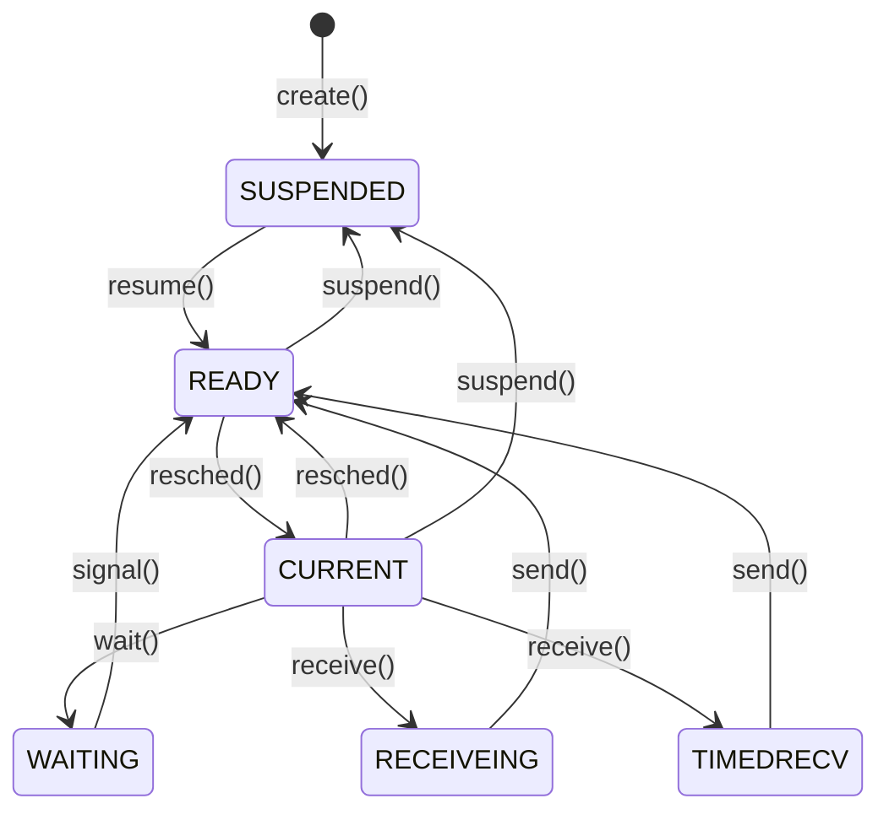

# Week 6 Message Passing

# Directory
- [Week 5 Memory Management](/week5/README.md#week-5-memory-management)
- **&rarr;[Week 6 Message Passing](/week6/README.md#week-6-message-passing)**
- [Week 7 Interrupts and Devices](/week7/README.md#week-7-interrupts-and-devices)

## 6.2 Interprocess Communication
([top](#directory))

### Message Passing as Synchronizaiton
- we've seen synchronization primitives to coordinate processes.
- how can processes share information?
  - shared memory
  - message passing
- in fact, synchronization and communication are related
  - *On the Duality of Operating System Structures* - Laurer and Needham, 1978

### Synchronicity
- Does a sending/receiving process block if its receiving/sending partner is not ready
- if so, we say this is synchronous send/receive
- if not, we say asynchronous
- also called blocking and nonblocking send/receive
- using message passing for synchronization requires blocking

### Four Possible Combinations

||blocking send|nonblocking send|
|-|-|-|
|**blocking receive**|fully synchronous, receiver waits for signal, sender waits for receiver|partially synchronous, receiver waits for sender, sender fires and forgets|
|**nonblocking receive**|partially synchronous, receiver alerted by signal, sender waits for receiver|full asynchronous, receiver alerted by signal, sender fires and forgets|

### Message Address
- Directly with recipient ID
  - Efficient
  - Need to know ID to send message
- Mailbox (or port)
  - allows multiple processes to share workload
  - review how web servers work

### Message and Queue Sizes
- how many messages can be outstanding for a process?
- if multiple, how will messages be stored?
- what limits are there on message storage?


## 6.3 Introduction to Xinu Low-Level Message Passing
([top](#directory))

### Xinu's Low-Level Messages
- Fixed-size messages (one word)
  - one integer or pointer
- senders never block
- receivers choose blocking or nonblocking call
- no message queues
  - only one unreceived message will be sotred for a receiving process
  - if receiver already has a pending message, addtional sent messages discarded

### Updated State Diagram


## 6.4 Xinu Low-Level Message-Passing Functions: `send()`
([top](#directory))

### Functions
- send()
  - if recipient doesn't have a message, deliver
  - if recipient is blocked for message, start it
- receive()
  - block until message arrives
  - return message
- recvclr()
  - clear incoming message
  - return message if present

`send()` uses the `ready()` function to activated a blocked receiving process.

## 6.5 Xinu Low-Level Message-Passing Functions: `receive()` and `recvclr()`
([top](#directory))

## 6.6 High-Level IPC in Xinu: ports
([top](#directory))

### Xinu Ports
- rendezvous point for message exchange
- no permanent binding of port to process
- multiple receivers can cooperate to serve requests
- processes can receive messages from multiple ports
- synchronous (sender waits for space)
- use buffer pools to store the messages

## Synchronizatoins
- number of slots to hold messages in port set at port creating time
- sender waits on sender semaphore
- receiver waitso n receiver semaphore
- sender semaphore initialized to port size (it counts slots)
- receiver semaphore initialized to 0
- this is a producer/consumer problem

## Buffer Pool Usage
- single buffer pool of messages shared by all ports
- allocated at system initialization time
  - not port-creation time
  - early port binding
- free lists of ports built through buffer pool

### Xinu port Functions
- `ptinit(maxmsgs)` initialize all ports (at boot time)
- `ptcreate(count)` create a port with count message slots
- `psend(port, msg)` send msg to port
  - will block if all slots are full
- `ptrecv(port)` receive message from port
  - will block if port is empty (no messages)
- `ptdelete(port,f)` delete a port
  - call f(msg) for each message in the port
  - then put message back on the free list
  - signal any waiting processes
- `ptreset(port,f)` reset a port
  - like ptdelete, wakes all processes/frees all messages
  - leave port ready for use

## 6.7 Early/Late Binding: Eager/Lazy Evaluation
([top](#directory))

### Early vs Late Binding
- when is a decision made?
  - compile time: early binding
  - runtime: late binding
- early binding tends to be more efficient
- late binding tends to be more flexible
- linked list vs array

### Xinu Process Lists
- early binding
- recall, all lists of processes are in a single array
  - processes can be on only one list
- number of semaphores fixed at compile time
- new entries cannot be added later
- less flexibility
- more efficiency

### FreeBSD Process Lists
- late binding
- traditional pointer-based, doubly linked lists
- processes can appear on multiple lists
- new entries can be allocated whenever needed
- more flexibility
- less efficiency

### Eager vs Lazy Evaluation
- fundamental question: when do we perform work?
- Lazy evaluation
  - only when it's needed
  - example: pure demand paging
- Eager evaluation
  - in anticipation of its being needed
  - do more work now to save work later
  - prefetching

### Why is eager evaluatoin more efficient

- cost of operation (Co)= startup cost (Cs) - per-item cost(Ci)

- Cs is usually constant (or, at worst, minimally affected by the amount of work to be performed)
- thus, work for a set of N items

- eagerly: Co=Cs+sum(i=1:n)[Ci]
- lazily:  C0=sum(i=1:n)[Cs+Ci]

### Wy not always eagerly evaluate?
- what if we really needed only $p\%$ of the work?
- eager cost remains the same
- lazy cost decreases by $(1-p)\%$
- sometimes, doing more work now actually creates more work later (example: prefetching)
- coosing eager vs lazy evaluation requires us to measure, or estimate Cs, Ci, and p


## 6.8 Xinu Port Data Structures
([top](#directory))

### `ports.h`

```c
/* ports.h - isbadport */

#define	NPORTS		30		/* maximum number of ports	*/
#define	PT_MSGS		100		/* total messages in system	*/
#define	PT_FREE		1		/* port is free			*/
#define	PT_LIMBO	2		/* port is being deleted/reset	*/
#define	PT_ALLOC	3		/* port is allocated		*/

struct	ptnode	{			/* node on list of messages 	*/
	uint32	ptmsg;			/* a one-word message		*/
	struct	ptnode	*ptnext;	/* ptr to next node on list	*/
};

struct	ptentry	{			/* entry in the port table	*/
	sid32	ptssem;			/* sender semaphore		*/
	sid32	ptrsem;			/* receiver semaphore		*/
	uint16	ptstate;		/* port state (FREE/LIMBO/ALLOC)*/
	uint16	ptmaxcnt;		/* max messages to be queued	*/
	int32	ptseq;			/* sequence changed at creation	*/
	struct	ptnode	*pthead;	/* list of message pointers	*/
	struct	ptnode	*pttail;	/* tail of message list		*/
};

extern	struct	ptnode	*ptfree;	/* list of free nodes		*/
extern	struct	ptentry	porttab[];	/* port table			*/
extern	int32	ptnextid;		/* next port ID to try when	*/
					/*   looking for a free slot	*/

#define	isbadport(portid)	( (portid)<0 || (portid)>=NPORTS )
```

## 6.9 Xinu Port Implementation, Part 1 Global Variables and `ptinit()`
([top](#directory))


**THIS IS IN XINU 2020**
```c
/* ptinit.c - ptinit */

#include <xinu.h>

struct	ptnode	*ptfree;		/* List of free message nodes	*/
struct	ptentry	porttab[NPORTS];	/* Port table			*/
int32	ptnextid;			/* Next table entry to try	*/

/*------------------------------------------------------------------------
 *  ptinit  -  Initialize all ports
 *------------------------------------------------------------------------
 */
syscall	ptinit(
	  int32	maxmsgs			/* Total messages in all ports	*/
	)
{
	int32	i;			/* Runs through the port table	*/
	struct	ptnode	*next, *curr;	/* Used to build a free list	*/

	/* Allocate memory for all messages on all ports */

	ptfree = (struct ptnode *)getmem(maxmsgs*sizeof(struct ptnode));
	if (ptfree == (struct ptnode *)SYSERR) {
		panic("ptinit - insufficient memory");
	}

	/* Initialize all port table entries to free */

	for (i=0 ; i<NPORTS ; i++) {
		porttab[i].ptstate = PT_FREE;
		porttab[i].ptseq = 0;
	}
	ptnextid = 0;

	/* Create a free list of message nodes linked together */

	for ( curr=next=ptfree ;  --maxmsgs > 0  ; curr=next ) {
		curr->ptnext = ++next;
	}

	/* Set the pointer in the final node to NULL */

	curr->ptnext = NULL;
	return OK;
}
```

## 6.10 Xinu Port Implementation, Part 2: `ptcreate()`
([top](#directory))

**THIS IS IN XINU 2020**
```c
/* ptcreate.c - ptcreate */

#include <xinu.h>

/*------------------------------------------------------------------------
 *  ptcreate  -  Create a port that allows "count" outstanding messages
 *------------------------------------------------------------------------
 */
syscall	ptcreate(
	  int32		count		/* Size of port			*/
	)
{
	intmask	mask;			/* Saved interrupt mask		*/
	int32	i;			/* Counts all possible ports	*/
	int32	ptnum;			/* Candidate port number to try	*/
	struct	ptentry	*ptptr;		/* Pointer to port table entry	*/

	mask = disable();
	if (count < 0) {
		restore(mask);
		return SYSERR;
	}

	for (i=0 ; i<NPORTS ; i++) {	/* Count all table entries	*/
		ptnum = ptnextid;	/* Get an entry to check	*/
		if (++ptnextid >= NPORTS) {
			ptnextid = 0;	/* Reset for next iteration	*/
		}

		/* Check table entry that corresponds to ID ptnum */

		ptptr= &porttab[ptnum];
		if (ptptr->ptstate == PT_FREE) {
			ptptr->ptstate = PT_ALLOC;
			ptptr->ptssem = semcreate(count);
			ptptr->ptrsem = semcreate(0);
			ptptr->pthead = ptptr->pttail = NULL;
			ptptr->ptseq++;
			ptptr->ptmaxcnt = count;
			restore(mask);
			return ptnum;
		}
	}
	restore(mask);
	return SYSERR;
}

```

## 6.11 Xinu Port Implementation, Part 3: `ptsend()`
([top](#directory))

- receiver semaphore counts messages
- sender semaphore counts slots


**THIS IS IN XINU 2020**
```c
/* ptsend.c - ptsend */

#include <xinu.h>

/*------------------------------------------------------------------------
 *  ptsend  -  Send a message to a port by adding it to the queue
 *------------------------------------------------------------------------
 */
syscall	ptsend(
	  int32		portid,		/* ID of port to use		*/
	  umsg32	msg		/* Message to send		*/
	)
{
	intmask	mask;			/* Saved interrupt mask		*/
	struct	ptentry	*ptptr;		/* Pointer to table entry	*/
	int32	seq;			/* Local copy of sequence num.	*/
	struct	ptnode	*msgnode;	/* Allocated message node 	*/
	struct	ptnode	*tailnode;	/* Last node in port or NULL	*/

	mask = disable();
	if ( isbadport(portid) ||
	     (ptptr= &porttab[portid])->ptstate != PT_ALLOC ) {
		restore(mask);
		return SYSERR;
	}

	/* Wait for space and verify port has not been reset */

	seq = ptptr->ptseq;		/* Record original sequence	*/
	if (wait(ptptr->ptssem) == SYSERR
	    || ptptr->ptstate != PT_ALLOC
	    || ptptr->ptseq != seq) {
		restore(mask);
		return SYSERR;
	}
	if (ptfree == NULL) {
		panic("Port system ran out of message nodes");
	}

	/* Obtain node from free list by unlinking */

	msgnode = ptfree;		/* Point to first free node	*/
	ptfree  = msgnode->ptnext;	/* Unlink from the free list	*/
	msgnode->ptnext = NULL;		/* Set fields in the node	*/
	msgnode->ptmsg  = msg;

	/* Link into queue for the specified port */

	tailnode = ptptr->pttail;
	if (tailnode == NULL) {		/* Queue for port was empty	*/
		ptptr->pttail = ptptr->pthead = msgnode;
	} else {			/* Insert new node at tail	*/
		tailnode->ptnext = msgnode;
		ptptr->pttail = msgnode;
	}
	signal(ptptr->ptrsem);
	restore(mask);
	return OK;
}
```

### Semaphore Handling in `ptsend()`
- note that we always `wait()` on ptssem
- and we always `signal()` ptrsem
- `ptssend()` is a producter, so:
  - waiting conveys that we're consuming a slow
  - signaling conveys that a new message has been produced
  - you could also thing of `ptrecv()` as producing slots and `ptsend()` consuming them


## 6.12 Xinu Port Implementation, Part 4: `ptrecv()`
([top](#directory))


**THIS IS IN XINU 2020**

```c
/* ptrecv.c - ptrecv */

#include <xinu.h>

/*------------------------------------------------------------------------
 *  ptrecv  -  Receive a message from a port, blocking if port empty
 *------------------------------------------------------------------------
 */
uint32	ptrecv(
	  int32		portid		/* ID of port to use		*/
	)
{
	intmask	mask;			/* Saved interrupt mask		*/
	struct	ptentry	*ptptr;		/* Pointer to table entry	*/
	int32	seq;			/* Local copy of sequence num.	*/
	umsg32	msg;			/* Message to return		*/
	struct	ptnode	*msgnode;	/* First node on message list	*/

	mask = disable();
	if ( isbadport(portid) ||
	     (ptptr= &porttab[portid])->ptstate != PT_ALLOC ) {
		restore(mask);
		return (uint32)SYSERR;
	}

	/* Wait for message and verify that the port is still allocated */

	seq = ptptr->ptseq;		/* Record orignal sequence	*/
	if (wait(ptptr->ptrsem) == SYSERR || ptptr->ptstate != PT_ALLOC
	    || ptptr->ptseq != seq) {
		restore(mask);
		return (uint32)SYSERR;
	}

	/* Dequeue first message that is waiting in the port */

	msgnode = ptptr->pthead;
	msg = msgnode->ptmsg;
	if (ptptr->pthead == ptptr->pttail)	/* Delete last item	*/
		ptptr->pthead = ptptr->pttail = NULL;
	else
		ptptr->pthead = msgnode->ptnext;
	msgnode->ptnext = ptfree;		/* Return to free list	*/
	ptfree = msgnode;
	signal(ptptr->ptssem);
	restore(mask);
	return msg;
}
```

### Xinu Port Implementations, Part 5: `ptdelete()` and `ptreset()`

- we will review code in the synchronous session
- they are almost identical. Both call a helper functino, `_ptclear(port, STATE, func)`
  - `port` is a pointer to the porttab entry
  - `STATE` is the state of the the port after clearing
    - `PT_FREE` for `ptdelete()`
    - `PT_ALLOC` for `ptreset()`
  - `func` is the disposal function to call on each message as it is removed from the port
- `ptdelete()` also sets the global variable `ptnextid`

### `_ptclear(ptptr,newstate,dispose)`

- sets port into LIMBO state (`PT_LIMBO`)
- calls disposal function on each message in queue
- links all messages in port into free list
- calls either `semreset()` or `semdelete()` on `ptssem` and `ptrsem`
- either call will wake blocked processes
  - this necessitates the LIMBO state
- sets the port to the state passed in